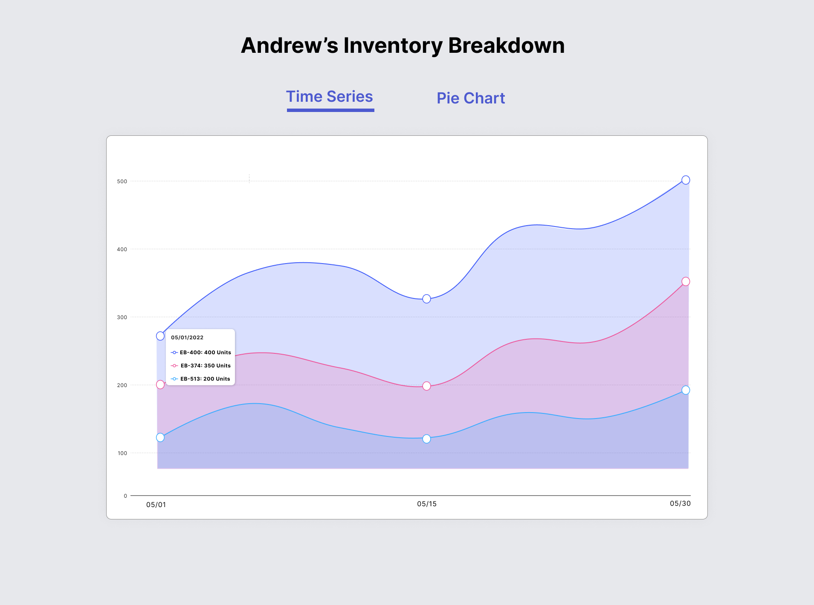
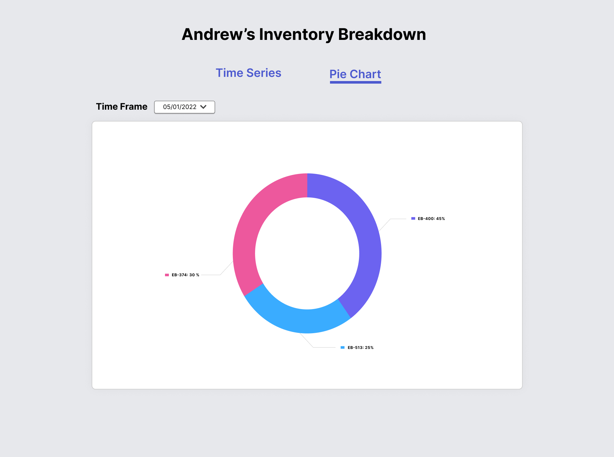

# UI Specifications

As part of the exercise, please create an interactive UI as close to these visual specifications as possible:

# Screen 1 - Time Series

For the first screen, I should be able to hover over a date point and see the inventory breakdown for any given date. This should be an interactive modal for any given date point.

# Screen 2 - Time Series

For the second screen, I should be able to have a date toggle to choose between the dates provided in the CSV. This should allow me to see the inventory breakdown by percentage for the given SKUs on the given dates.

# Design Assets

- Font used: Inter UI [Link](https://fonts.google.com/specimen/Inter/)
- Background colour hex: #E7E8EC
- Red colour used hex: #ED589D
- Purple colour used hex: #6C63F0
- Blue colour used: #3AACFF
